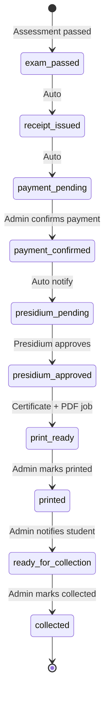

# Certificate application state machine

Technical reference for `CertificateApplicationStatus` (`backend/app/Enums/CertificateApplicationStatus.php`). Operator procedures: [ACADEMY-CERTIFICATE-WORKFLOW.md](./ACADEMY-CERTIFICATE-WORKFLOW.md).

---

## Status values

| Status | Label | Typical actor |
|--------|-------|---------------|
| `exam_passed` | Exam passed | System (on assessment pass) |
| `receipt_issued` | Receipt issued | System |
| `payment_pending` | Awaiting payment | Student (views receipt in portal) |
| `payment_confirmed` | Payment confirmed | Academy admin |
| `presidium_pending` | Awaiting Presidium approval | System (after payment) |
| `presidium_approved` | Presidium approved | Presidium role |
| `print_ready` | Ready to print | System (creates `Certificate`, queues PDF) |
| `printed` | Printed | Academy admin |
| `ready_for_collection` | Ready for collection | Academy admin |
| `collected` | Collected | Academy admin |
| `cancelled` | Cancelled | Admin (edge cases) |

---

## Happy-path flow

---

## Side effects (implementation)

| Transition | Service / job | Notes |
|------------|---------------|-------|
| Exam pass → application | `CertificateApplicationService` | Creates application, receipt number, payment reference |
| Receipt PDF | `ReceiptPdfService` | Format `ZPF-REC-YYYY-…` |
| Payment confirmed | `confirmPayment()` | May grant `member` role per `config/academy.php` |
| Presidium approve | `presidiumApprove()` | Creates `Certificate` record |
| Print ready | `GenerateCertificatePdfJob` | TCPDF via `CertificatePdfService` |
| Notifications | Laravel notifications + `SendAcademyApplicationMailJob` | Mail queue + DB portal messages |
| Student API | `GET /api/v1/academy/applications` | Receipt PDF download; **no** student certificate PDF in government mode |

---

## Key tables

`certificate_applications` — see migration `2026_05_23_100100_create_certificate_applications_table.php`:

- `receipt_number`, `payment_reference_code`, `fee_amount`, `fee_currency`
- Audit FKs: `payment_confirmed_by`, `presidium_approved_by`, `printed_by`, `collected_by`
- Timestamps: `exam_passed_at`, `payment_confirmed_at`, `presidium_approved_at`, `printed_at`, `ready_for_collection_at`, `collected_at`
- Unique: one application per `(user_id, course_id)`

---

## Config

| Key | File | Purpose |
|-----|------|---------|
| `grant_member_role_on` | `config/academy.php` | `payment_confirmed` or `exam_pass` |
| `payment_offices` | `config/academy.php` | Static office list for receipts |
| `student_certificate_download_enabled` | `config/academy.php` | Usually `false` for government workflow |
