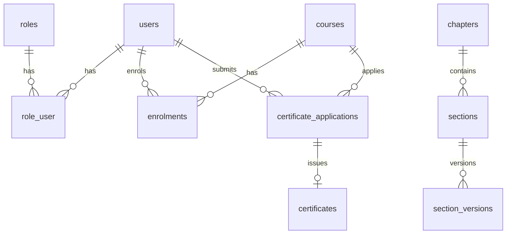

# Data model reference

Table catalog derived from `backend/database/migrations/`. For **exact columns**, read the migration file named in each section or restore from git.

**49 Eloquent models** map to these tables (see `backend/app/Models/`).

---

## Platform & auth

| Table | Model | Purpose |
|-------|-------|---------|
| `users` | `User` | All accounts (students, members, admins) |
| `roles` | `Role` | Role slugs (`system_admin`, `student`, `member`, …) |
| `role_user` | — | User ↔ role pivot |
| `permissions` | `Permission` | Fine-grained permissions |
| `permission_role` | — | Role ↔ permission pivot |
| `personal_access_tokens` | — | Sanctum API tokens |
| `refresh_tokens` | `RefreshToken` | API refresh token rotation |
| `password_reset_tokens` | — | Laravel password resets |
| `sessions` | — | Web session driver |
| `site_settings` | `SiteSetting` | Key/value platform config (JSON values) |
| `backend_user_invitations` | `BackendUserInvitation` | Admin invite tokens |
| `admin_activity_reads` | `AdminActivityRead` | Dashboard bell “seen” state |
| `notifications` | — | Laravel DB notifications (academy portal) |

### `site_settings` keys (application)

| Key | Type | Set by |
|-----|------|--------|
| `org_name` | string | Setup wizard / admin platform settings |
| `support_email` | string | Setup wizard / admin |
| `public_site_url` | string | Setup wizard (Installation URL) |
| `legal_privacy_url` | string | Setup wizard / admin |
| `legal_terms_url` | string | Setup wizard / admin |
| `legal_cookies_url` | string | Setup wizard / admin |
| `enable_dialogue` | bool | Setup wizard / admin |
| `require_national_id` | bool | Setup wizard / admin |
| `installed_at` | ISO8601 string | Setup wizard complete (locks `/setup`) |

---

## Constitution CMS

| Table | Model | Notes |
|-------|-------|-------|
| `parts` | `Part` | Top-level structure |
| `chapters` | `Chapter` | Includes `constitution_slug` (`zanupf`, `zimbabwe`, …) |
| `sections` | `Section` | Article/section nodes |
| `section_versions` | `SectionVersion` | Draft/review/approved body text |
| `section_summary_versions` | `SectionSummaryVersion` | Summaries |
| `article_aliases` | `ArticleAlias` | Alternate numbering |
| `section_comments` | — | Public comments on sections |
| `amendment_clause_relations` | `AmendmentClauseRelation` | Amendment cross-links |

---

## Academy (LMS)

| Table | Model |
|-------|-------|
| `courses` | `Course` |
| `modules` | `Module` |
| `lessons` | `Lesson` |
| `assessments` | `Assessment` |
| `questions` | `Question` |
| `options` | `Option` |
| `enrolments` | `Enrolment` |
| `assessment_attempts` | `AssessmentAttempt` |
| `assessment_answers` | `AssessmentAnswer` |
| `academy_badges` | `AcademyBadge` |
| `academy_user_badges` | `AcademyUserBadge` |

`courses` includes membership flags, certificate fee fields (`certificate_fee_amount`, `certificate_fee_currency`), certificate title.

---

## Certificates (government workflow)

| Table | Model | Purpose |
|-------|-------|---------|
| `certificate_applications` | `CertificateApplication` | Workflow hub (receipt → payment → Presidium → print → collection) |
| `certificates` | `Certificate` | Issued certificate record + PDF metadata |

See [CERTIFICATE-STATE-MACHINE.md](./CERTIFICATE-STATE-MACHINE.md) for status values and transitions.

---

## Dialogue (UGC chat)

| Table | Model |
|-------|-------|
| `dialogue_channels` | `DialogueChannel` |
| `dialogue_threads` | `DialogueThread` |
| `dialogue_messages` | `DialogueMessage` |
| `dialogue_message_attachments` | `DialogueMessageAttachment` |
| `dialogue_thread_reads` | `DialogueThreadRead` |
| `dialogue_reports` | `DialogueReport` |
| `user_blocks` | `UserBlock` |

---

## Party, library, content

| Table | Model |
|-------|-------|
| `party_profiles` | `PartyProfile` |
| `party_profile_related_sections` | `PartyProfileRelatedSection` |
| `party_organs` | `PartyOrgan` |
| `party_leagues` | `PartyLeague` |
| `presidium_members` | `PresidiumMember` |
| `presidium_publications` | `PresidiumPublication` |
| `priority_projects` | `PriorityProject` |
| `priority_project_likes` | `PriorityProjectLike` |
| `home_banners` | `HomeBanner` |
| `library_categories` | `LibraryCategory` |
| `library_documents` | `LibraryDocument` |
| `static_pages` | `StaticPage` |
| `provinces` | `Province` |
| `support_questions` | `SupportQuestion` |

---

## Audit & ops

| Table | Model |
|-------|-------|
| `audit_logs` | `AuditLog` |
| `jobs`, `job_batches`, `failed_jobs` | Queue |
| `cache`, `cache_locks` | Cache driver |

---

## Domain relationships (simplified)

---

*Regenerate this catalog when adding migrations. Column detail lives in `backend/database/migrations/`.*
