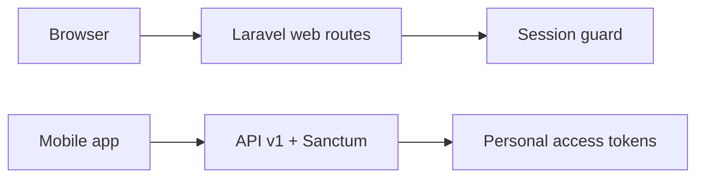

# 1. Architecture overview

**Scope:** Laravel backend (`backend/`), Blade web app for admins and readers, JSON API for mobile.

## 1.1 Stack

| Layer | Technology |
|-------|------------|
| Framework | Laravel 11+ (PHP) |
| Web UI | Blade templates, session auth for `/login`, `/dashboard`, `/admin/*` |
| API | Laravel Sanctum (`auth:sanctum`) — Bearer tokens for `/api/v1/*` |
| Database | MySQL/MariaDB (typical; see `.env`) |
| PDF | TCPDF + FPDI (`CertificatePdfService`) for certificates |

## 1.2 Request flows

- **Web:** `routes/web.php` — public pages, auth middleware, `admin.content` + `admin.section` for admin areas.
- **API:** `routes/api.php` — prefixed `v1`; mix of public routes and `auth:sanctum` groups.

## 1.3 Major directories

| Path | Role |
|------|------|
| `app/Http/Controllers/` | Web + API controllers (`Api/`, `Admin/`) |
| `app/Http/Middleware/` | `EnsureAdminOrContentEditor`, `EnsureAdminSection`, `EnsurePresidiumAccess`, throttles |
| `app/Services/` | Domain services: `AdminAccessService`, `CertificatePdfService`, `MembershipService`, `ProvinceStatsService`, `AuditLogger`, `DialogueChannelService`, etc. |
| `app/Models/` | Eloquent models (`User`, `Role`, `Course`, `Section`, `Certificate`, …) |
| `config/admin.php` | Admin section → allowed role slugs |
| `config/role_workflows.php` | Dashboard copy per role |
| `resources/views/` | Blade: `layouts/dashboard`, `admin/*`, `sections/*` |

## 1.4 Authentication guards

| Context | Mechanism |
|---------|-----------|
| Web admin | Session (`auth` middleware), login via `WebAuthController` |
| API | Sanctum token in `Authorization: Bearer` header |

Users are one `users` table; roles attach via `role_user` pivot.

## 1.5 Health & monitoring

- `GET /health` and `GET /api/v1/health` — `HealthController@show` for load balancers/uptime.

## 1.6 Related chapters

- [03-authentication.md](./03-authentication.md) — login flows and audit events  
- [04-admin-rbac.md](./04-admin-rbac.md) — admin access model  
- [20-api-overview.md](./20-api-overview.md) — API conventions  

---

*Last reviewed: documentation generation pass.*
