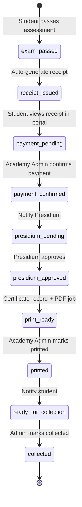

# Academy Government Certificate & Payment Workflow – Implementation Plan

> **For agentic workers:** REQUIRED SUB-SKILL: Use superpowers:subagent-driven-development (recommended) or superpowers:executing-plans to implement this plan task-by-task. Steps use checkbox (`- [ ]`) syntax for tracking.

**Goal:** Replace the current “instant certificate PDF for students” flow with a government-led workflow: exam pass → portal message + payment receipt → offline payment at government office → Academy Admin confirms payment → Presidium approves → Admin prints certificate → student notified for collection. Students never download certificates from the app.

**Architecture:** Introduce a `CertificateApplication` state machine as the workflow hub (receipt, payment, approval, print, collection). Course admin sets `certificate_fee_amount` + currency per course. On exam pass, create application + receipt (not a downloadable certificate). Gate `Certificate` record creation and PDF generation behind Presidium approval. Use Laravel notifications (`mail` + `database` channels) for email and in-app Academy portal messages. Admin actions are role-gated and audit-logged.

**Tech Stack:** Laravel 12 (backend), Blade admin UI, Expo/React Native mobile, existing `CertificatePdfService` pattern for receipt PDF, Sanctum API, existing Presidium action gate pattern (`EnsurePresidiumAccess` / `admin.action.presidium_publish`).

---

## Business workflow (target state)



| Step | Actor | Student sees | Email |
|------|-------|--------------|-------|
| 1. Exam passed | System | Portal message + receipt | “Exam passed – payment required” |
| 2. Receipt issued | System | Receipt with codes + amount + office instructions | Same email includes receipt summary |
| 3. Payment at office | Student (offline) | Status: “Awaiting payment confirmation” | — |
| 4. Payment confirmed | Academy Admin | Status: “Payment confirmed – awaiting approval” | “Payment received” |
| 5. Presidium approval | Presidium | Status: “Approved – certificate being prepared” | “Certificate approved for printing” |
| 6. Print | Academy Admin | Status: “Certificate printed – collect at office” | “Your certificate is ready for collection” |
| 7. Collection | Student + Admin | Status: “Collected” | “Collection confirmed” (optional) |

---

## Policy decisions (locked for v1)

| Decision | Choice | Rationale |
|----------|--------|-----------|
| Member role timing | **After payment confirmed** (not on exam pass) | Government membership should follow fee payment; exam pass alone grants “eligible” status only |
| Student certificate PDF | **Never** via mobile API | Certificates are printed and collected physically |
| Certificate DB record | Created when **Presidium approves** (before PDF) | Backend holds certificate data; student sees application status only |
| One application per pass | **One active application per user+course**; idempotent on re-submit of same attempt | Prevents duplicate receipts |
| Fee amount | **Snapshotted** on application at pass time | Course fee changes do not affect in-flight applications |
| Currency | **USD** default; field supports `currency` code (ISO 4217) for future ZWL | Admin sets per course |

Configurable override: `config/academy.php` → `grant_member_role_on` = `payment_confirmed` | `exam_pass` (default: `payment_confirmed`).

### Locked product decisions (2026-05-23)

| Decision | Choice |
|----------|--------|
| Member role timing | **After payment confirmed** |
| Default currency | **USD** |
| Default membership course fee | **USD 25.00** (`config/academy.php` → `default_membership_fee_amount`) |
| Government offices | **Static list in `config/academy.php`** for v1; documented in `docs/ACADEMY-CERTIFICATE-WORKFLOW.md`; per-province override optional later via `payment_office_instructions` on course |
| Provincial admin scoping | **Yes** — applications filtered by applicant `users.province_id` |
| Province at registration | **Required** on API + web registration (not profile-only) |

---

## File structure (new & modified)

| File | Responsibility |
|------|----------------|
| `backend/database/migrations/2026_05_23_100000_add_certificate_fee_to_courses.php` | Fee fields on courses |
| `backend/database/migrations/2026_05_23_100100_create_certificate_applications_table.php` | Workflow hub |
| `backend/config/academy.php` | Workflow config, office instructions text, receipt prefix |
| `backend/app/Models/CertificateApplication.php` | State machine model |
| `backend/app/Enums/CertificateApplicationStatus.php` | Status enum (PHP 8.1 backed enum) |
| `backend/app/Services/CertificateApplicationService.php` | Transitions, validation, idempotency |
| `backend/app/Services/ReceiptPdfService.php` | Payment receipt PDF |
| `backend/app/Services/MembershipService.php` | **Modify:** create application on pass; defer member role |
| `backend/app/Policies/CertificateApplicationPolicy.php` | Student read own; admin actions |
| `backend/app/Policies/CertificatePolicy.php` | **Modify:** deny student PDF; admin-only download when print_ready+ |
| `backend/app/Http/Controllers/Api/CertificateApplicationController.php` | Student receipt API |
| `backend/app/Http/Controllers/Admin/CertificateApplicationsController.php` | Admin workflow queue |
| `backend/app/Http/Controllers/Admin/CertificatesController.php` | **Modify:** presidium-gated print download |
| `backend/app/Notifications/Academy/*.php` | 5 workflow emails (+ database channel) |
| `backend/resources/views/admin/certificate-applications/` | Admin queue UI |
| `backend/resources/views/admin/academy/course-form.blade.php` | **Modify:** fee fields |
| `backend/resources/views/pdf/payment-receipt.blade.php` | Receipt template |
| `mobile/src/api/academyApi.js` | **Modify:** applications/receipt endpoints |
| `mobile/src/screens/PaymentReceiptScreen.js` | Receipt view + share PDF |
| `mobile/src/screens/AcademyPortalScreen.js` | Status messages list |
| `mobile/src/screens/AssessmentResultScreen.js` | **Modify:** pass → receipt flow |
| `docs/RBAC-MATRIX.md` | New actions + workflow |
| `backend/tests/Feature/CertificateApplicationWorkflowTest.php` | E2E workflow tests |

---

## Data model

### `courses` (add columns)

```php
$table->decimal('certificate_fee_amount', 10, 2)->nullable();
$table->string('certificate_fee_currency', 3)->default('USD');
$table->text('payment_office_instructions')->nullable(); // override per course optional
```

Validation on admin course form: if `grants_membership` or course issues certificates, `certificate_fee_amount` required and > 0.

### `certificate_applications`

```php
Schema::create('certificate_applications', function (Blueprint $table) {
    $table->id();
    $table->uuid('public_id')->unique();
    $table->foreignId('user_id')->constrained()->cascadeOnDelete();
    $table->foreignId('course_id')->constrained()->cascadeOnDelete();
    $table->foreignId('assessment_attempt_id')->constrained()->cascadeOnDelete();
    $table->string('receipt_number')->unique();       // ZP-REC-2026-XXXXXXXX
    $table->string('payment_reference_code', 16)->unique(); // office lookup code
    $table->decimal('fee_amount', 10, 2);
    $table->string('fee_currency', 3)->default('USD');
    $table->string('status'); // CertificateApplicationStatus enum
    $table->timestamp('exam_passed_at');
    $table->timestamp('payment_confirmed_at')->nullable();
    $table->foreignId('payment_confirmed_by')->nullable()->constrained('users')->nullOnDelete();
    $table->string('payment_reference_note')->nullable(); // gov receipt / teller ref
    $table->timestamp('presidium_approved_at')->nullable();
    $table->foreignId('presidium_approved_by')->nullable()->constrained('users')->nullOnDelete();
    $table->text('presidium_note')->nullable();
    $table->foreignId('certificate_id')->nullable()->constrained()->nullOnDelete();
    $table->timestamp('printed_at')->nullable();
    $table->foreignId('printed_by')->nullable()->constrained('users')->nullOnDelete();
    $table->timestamp('ready_for_collection_at')->nullable();
    $table->timestamp('collected_at')->nullable();
    $table->foreignId('collected_by')->nullable()->constrained('users')->nullOnDelete();
    $table->string('collection_office')->nullable();
    $table->timestamps();
    $table->unique(['user_id', 'course_id']); // one application per user per course (v1)
});
```

### `CertificateApplicationStatus` enum

```php
enum CertificateApplicationStatus: string
{
    case ExamPassed = 'exam_passed';
    case ReceiptIssued = 'receipt_issued';
    case PaymentPending = 'payment_pending';
    case PaymentConfirmed = 'payment_confirmed';
    case PresidiumPending = 'presidium_pending';
    case PresidiumApproved = 'presidium_approved';
    case PrintReady = 'print_ready';
    case Printed = 'printed';
    case ReadyForCollection = 'ready_for_collection';
    case Collected = 'collected';
    case Cancelled = 'cancelled';
}
```

Initial flow on pass: `exam_passed` → immediately transition to `receipt_issued` → `payment_pending` (student-facing status).

---

## RBAC & admin actions

Add to `config/permissions.php` admin actions:

| Action slug | Roles | Purpose |
|-------------|-------|---------|
| `academy_payment_confirm` | academy_manager, system_admin | Confirm offline payment |
| `academy_certificate_presidium_approve` | presidium, system_admin | Approve certificate for printing |
| `academy_certificate_print` | academy_manager, system_admin | Mark printed + download PDF |
| `academy_certificate_collection` | academy_manager, system_admin | Mark ready/collected |

New admin section route group: `admin.certificate-applications.*` under certificates or academy section.

Presidium approval uses same pattern as constitution amendments:

```php
// CertificateApplicationsController@approve
$this->authorize('admin.action', 'academy_certificate_presidium_approve');
// or reuse presidium_publish with new dedicated action (preferred for audit clarity)
```

---

## API changes (mobile)

### New student endpoints (`abilities:academy:read`)

| Method | Route | Response |
|--------|-------|----------|
| GET | `/academy/applications` | List user's applications with status labels |
| GET | `/academy/applications/{application}` | Detail: receipt codes, amount, office instructions, timeline |
| GET | `/academy/applications/{application}/receipt.pdf` | Download/share receipt PDF |

### Restrict existing certificate endpoints

| Endpoint | Change |
|----------|--------|
| `GET /certificates` | Return **empty array** for students (or 403 with message) — certificates are admin-only |
| `POST /certificates/{id}/generate` | **Remove** from student API (admin only) |
| `GET /certificates/{id}/pdf` | **Remove** from student API (admin only) |

Admin print download: `GET /admin/certificates/{certificate}/pdf` (session auth, requires `print_ready`+ and presidium approved).

### Academy summary extension

`GET /academy/summary` add:

```json
{
  "pending_payment_applications": 1,
  "latest_application_status": "payment_pending",
  "portal_messages": [{ "title": "...", "body": "...", "at": "..." }]
}
```

---

## Phase 1 – Foundation (backend data + pass hook)

### Task 1: Migrations + enum + model

**Files:**
- Create: `backend/database/migrations/2026_05_23_100000_add_certificate_fee_to_courses.php`
- Create: `backend/database/migrations/2026_05_23_100100_create_certificate_applications_table.php`
- Create: `backend/app/Enums/CertificateApplicationStatus.php`
- Create: `backend/app/Models/CertificateApplication.php`
- Create: `backend/config/academy.php`

- [ ] **Step 1: Write failing test** — `CertificateApplicationWorkflowTest::test_passing_exam_creates_application_with_receipt`

```php
public function test_passing_exam_creates_application_with_receipt(): void
{
    // Arrange: user, published membership course with fee, enrolment, assessment, pass submit
    // Assert: CertificateApplication exists, status payment_pending, receipt_number set, fee matches course
    // Assert: no Certificate row yet (or certificate not linked)
    // Assert: user does NOT have member role yet (default config)
}
```

- [ ] **Step 2: Run test** — `docker compose exec app php artisan test --filter=test_passing_exam_creates_application_with_receipt` → FAIL

- [ ] **Step 3: Implement migrations, model, enum, config**

- [ ] **Step 4: Run test** → PASS

- [ ] **Step 5: Commit** — `feat(academy): add certificate application model and course fees`

### Task 2: CertificateApplicationService + refactor MembershipService

**Files:**
- Create: `backend/app/Services/CertificateApplicationService.php`
- Modify: `backend/app/Services/MembershipService.php`
- Modify: `backend/app/Http/Controllers/Api/AcademyAssessmentController.php` (no change if service called from MembershipService)

- [ ] **Step 1: Write failing test** — `test_application_is_idempotent_for_same_attempt`

- [ ] **Step 2: Implement `createFromPassedAttempt(AssessmentAttempt $attempt): CertificateApplication`**
  - Validate course has fee
  - Generate `receipt_number` (`ZP-REC-{Y}-{random}`)
  - Generate `payment_reference_code` (8–12 alphanumeric, unique)
  - Snapshot fee from course
  - Set status → payment_pending
  - Audit: `academy.application.created`

- [ ] **Step 3: Refactor `MembershipService::grantMembershipIfPassed`**
  - Remove immediate `Certificate::firstOrCreate`
  - Remove immediate `member` role attach (unless config override)
  - Call `CertificateApplicationService::createFromPassedAttempt`
  - Dispatch notification (Task 5)

- [ ] **Step 4: Run full academy tests** → PASS

- [ ] **Step 5: Commit**

### Task 3: Admin course fee fields

**Files:**
- Modify: `backend/app/Http/Controllers/Admin/AcademyController.php` (courseStore, courseUpdate validation)
- Modify: `backend/resources/views/admin/academy/course-form.blade.php`
- Modify: `backend/database/seeders/MembershipCourseSeeder.php` (set fee e.g. 25.00 USD)

- [ ] Add fee amount, currency, optional office instructions to form
- [ ] Validate required when course grants membership
- [ ] Commit

---

## Phase 2 – Receipt PDF + student API

### Task 4: ReceiptPdfService

**Files:**
- Create: `backend/app/Services/ReceiptPdfService.php`
- Create: `backend/resources/views/pdf/payment-receipt.blade.php`

Receipt PDF must include:
- Student name, national ID (masked: `63-123456-X12-7` → `63-******-X**-7` if policy requires)
- Course title
- Receipt number + payment reference code
- Fee amount + currency
- Date of exam pass
- Government office payment instructions (from config + course override)
- QR code encoding verification URL: `{APP_URL}/verify-receipt/{public_id}` (optional v1: plain URL text)

- [ ] Test: `test_receipt_pdf_download_returns_pdf_for_owner`
- [ ] Commit

### Task 5: Student API controller

**Files:**
- Create: `backend/app/Http/Controllers/Api/CertificateApplicationController.php`
- Create: `backend/app/Policies/CertificateApplicationPolicy.php`
- Modify: `backend/routes/api.php`

- [ ] Implement index, show, receiptPdf
- [ ] Policy: user can only view own applications
- [ ] Commit

### Task 6: Gate old certificate student API

**Files:**
- Modify: `backend/app/Http/Controllers/Api/CertificateController.php`
- Modify: `backend/app/Policies/CertificatePolicy.php`
- Modify: `backend/routes/api.php` (move generate/download to admin or remove from api.php)

- [ ] `index()` returns applications messaging or empty with `meta.legacy_certificates_disabled: true`
- [ ] `generate()` / `download()` return 403 for API students
- [ ] Update `CertificateApiAuthorizationTest`
- [ ] Commit

---

## Phase 3 – Admin workflow UI

### Task 7: CertificateApplicationsController

**Files:**
- Create: `backend/app/Http/Controllers/Admin/CertificateApplicationsController.php`
- Create: `backend/resources/views/admin/certificate-applications/index.blade.php`
- Create: `backend/resources/views/admin/certificate-applications/show.blade.php`
- Modify: `backend/routes/web.php`
- Modify: `backend/resources/views/layouts/dashboard.blade.php` (nav link under Certificates)

**Admin queue tabs:** Payment pending | Awaiting Presidium | Ready to print | Awaiting collection | Completed

**Actions on show page:**

| Action | Route | Guard |
|--------|-------|-------|
| Confirm payment | POST `.../confirm-payment` | academy_payment_confirm |
| Presidium approve | POST `.../presidium-approve` | academy_certificate_presidium_approve |
| Mark printed | POST `.../mark-printed` | academy_certificate_print |
| Mark ready for collection | POST `.../ready-for-collection` | academy_certificate_collection |
| Mark collected | POST `.../mark-collected` | academy_certificate_collection |
| Download certificate PDF | GET `.../certificate.pdf` | print_ready+, presidium approved |

- [ ] **On presidium approve:** create `Certificate` record, link to application, dispatch `GenerateCertificatePdfJob`, set status `print_ready`
- [ ] **On confirm payment:** optionally attach `member` role, set status `presidium_pending`, notify presidium (email to role or configurable list)
- [ ] Audit each transition: `academy.application.payment_confirmed`, `.presidium_approved`, `.printed`, `.ready_for_collection`, `.collected`
- [ ] Commit

### Task 8: Permissions sync + RBAC docs

**Files:**
- Modify: `backend/config/permissions.php`
- Modify: `docs/RBAC-MATRIX.md`
- Run: `php artisan permissions:sync`

- [ ] Commit

---

## Phase 4 – Notifications (email + portal)

### Task 9: Notification classes

**Files:**
- Create: `backend/app/Notifications/Academy/ExamPassedPaymentRequiredNotification.php`
- Create: `backend/app/Notifications/Academy/PaymentConfirmedNotification.php`
- Create: `backend/app/Notifications/Academy/CertificatePresidiumApprovedNotification.php`
- Create: `backend/app/Notifications/Academy/CertificateReadyForCollectionNotification.php`
- Create: `backend/app/Notifications/Academy/CertificateCollectedNotification.php`

Each notification:
```php
public function via(object $notifiable): array
{
    return ['mail', 'database'];
}
```

Database payload (for portal):
```php
return [
    'type' => 'academy.application.payment_pending',
    'application_id' => $this->application->id,
    'title' => 'Exam passed – payment required',
    'body' => '...',
    'receipt_number' => $this->application->receipt_number,
];
```

- [ ] Create `notifications` table migration if not exists (`php artisan notifications:table`)
- [ ] Wire sends in `CertificateApplicationService` transition methods
- [ ] Test with `Notification::fake()` for each transition
- [ ] Commit

### Task 10: Portal messages API

**Files:**
- Modify: `backend/app/Http/Controllers/Api/AcademyCourseController.php` (summary method)
- Create: `backend/app/Http/Controllers/Api/UserNotificationController.php` (optional: `GET /notifications`)

- [ ] Include unread/recent academy notifications in summary or dedicated endpoint
- [ ] Commit

---

## Phase 5 – Mobile UX

### Task 11: Replace certificate flow with receipt flow

**Files:**
- Create: `mobile/src/screens/PaymentReceiptScreen.js`
- Create: `mobile/src/screens/AcademyPortalScreen.js` (or extend AcademyScreen with status panel)
- Modify: `mobile/src/api/academyApi.js`
- Modify: `mobile/src/screens/AssessmentResultScreen.js`
- Modify: `mobile/src/screens/MainNavigator.js`
- Modify: `mobile/src/screens/AcademyScreen.js` (portal status banner)
- Modify: `mobile/src/screens/CertificatesScreen.js` → repurpose as **Academy Status / Receipts** or hide route

**AssessmentResultScreen (pass):**
- Text: “You passed! A payment receipt has been issued. Take it to the government office to pay the certificate fee.”
- Primary button: “View payment receipt” → `PaymentReceiptScreen`
- Remove “View certificates” button

**PaymentReceiptScreen:**
- Show receipt number, payment reference, amount, status timeline
- “Download receipt PDF” (FileSystem + Sharing, same pattern as old CertificatesScreen)
- Office instructions text from API

- [ ] Commit mobile changes (separate commit in mobile repo if submodule)

---

## Phase 6 – Tests & documentation

### Task 12: Full workflow integration test

**File:** `backend/tests/Feature/CertificateApplicationWorkflowTest.php`

- [ ] `test_full_workflow_from_pass_to_collection`
- [ ] `test_student_cannot_download_certificate_pdf`
- [ ] `test_academy_admin_cannot_presidium_approve`
- [ ] `test_presidium_cannot_confirm_payment`
- [ ] `test_certificate_pdf_only_after_presidium_approval`
- [ ] `test_emails_sent_at_each_step`

### Task 13: Documentation

**Files:**
- Create: `docs/ACADEMY-CERTIFICATE-WORKFLOW.md` (operator runbook for government offices)
- Modify: `docs/backend-manual/` (academy section)
- Modify: `docs/AUDIT-LOGGING.md` (new events)

---

## Audit events (new)

| Event | When |
|-------|------|
| `academy.application.created` | Exam pass creates application |
| `academy.application.payment_confirmed` | Admin confirms payment |
| `academy.application.presidium_approved` | Presidium approves |
| `academy.application.printed` | Admin marks printed |
| `academy.application.ready_for_collection` | Ready for pickup |
| `academy.application.collected` | Student collected |
| `academy.application.cancelled` | Admin cancels (edge case) |

---

## Migration / rollout notes

1. **Existing certificates:** Leave as-is; add migration note that legacy certificates remain downloadable only if issued before feature flag date. Config: `academy.legacy_student_certificate_download_until` (null = disabled immediately).

2. **Existing passed users without application:** Optional one-time artisan command `academy:backfill-applications` for users with graded pass attempts but no application (run manually in production).

3. **MembershipCourseSeeder:** Set default fee; re-seed in dev Docker.

4. **Mail in dev:** `MAIL_MAILER=log`; verify emails in `storage/logs/laravel.log`.

---

## Execution order (recommended)

| Phase | Scope | Est. | Depends on |
|-------|-------|------|------------|
| **1** | Model + pass hook + course fees | 1 session | — |
| **2** | Receipt PDF + student API + lock cert API | 1 session | Phase 1 |
| **3** | Admin workflow + Presidium gate | 1–2 sessions | Phase 2 |
| **4** | Notifications | 0.5 session | Phase 3 |
| **5** | Mobile UX | 1 session | Phase 2+ |
| **6** | Tests + docs | 0.5 session | All |

**Total:** ~5–6 focused sessions. Phases 1–3 deliver a testable backend workflow; Phase 5 can start once Phase 2 student API exists.

---

## Self-review (spec coverage)

| Requirement | Task |
|-------------|------|
| Message on academy portal after pass | Task 9–10 (database notifications) + Task 11 (mobile banner) |
| No student certificate | Task 6 + Task 11 |
| Auto receipt with codes + amount | Task 2 + Task 4 |
| Backend sets amount per course | Task 3 |
| Pay at government office (offline) | Workflow design + receipt instructions |
| Academy Admin confirms payment | Task 7 |
| Presidium must approve before print | Task 7 |
| Admin prints certificate | Task 7 (PDF download admin-only) |
| Email at every step | Task 9 |
| Student notified for collection | Task 9 (`CertificateReadyForCollectionNotification`) |

**Open question for product owner before execution:**
- ~~Exact **government office list / addresses** for receipt text~~ → **Resolved:** static config + operator doc
- ~~**Provincial Admin** scope~~ → **Resolved:** yes, via `user.province_id`
- ~~Member role / fee / currency~~ → **Resolved:** payment confirmed; USD 25.00 default

### Task 0: Province required at registration (prerequisite for provincial scoping)

**Files:**
- Modify: `backend/app/Http/Controllers/AuthController.php` (API register)
- Modify: `backend/app/Http/Controllers/WebAuthController.php` + `resources/views/auth/register.blade.php`
- Modify: `backend/tests/Feature/RegistrationRolesTest.php`, `AuthApiTest.php`
- Modify: `mobile/` registration screen when present (or document profile step before academy)

- [ ] Add `province_id` => `required|exists:provinces,id` to register validation
- [ ] Persist on `User::create`
- [ ] Test: registration without province → 422
- [ ] Commit — `feat(auth): require province at registration`

---

## Execution handoff

Plan complete and saved to `docs/superpowers/plans/2026-05-23-academy-government-certificate-workflow.md`.

**Two execution options:**

1. **Subagent-Driven (recommended)** — one task per session with review between tasks
2. **Inline Execution** — implement phases sequentially in this chat with checkpoints

**Which approach?** Confirm also: member role on **payment confirmed** (recommended) vs exam pass, and default certificate fee for membership course.
